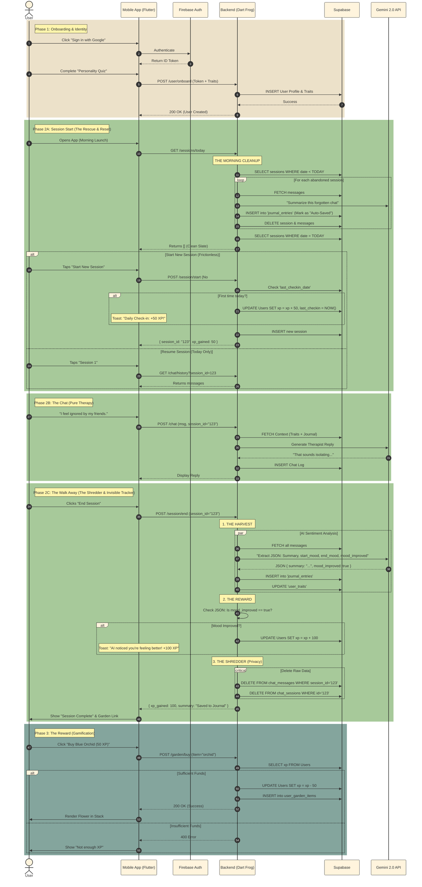

## Backend flow

```mermaid
%%{init: {'theme': 'base', 'themeVariables': { 'lineColor': '#222', 'sequenceNumberColor': '#fff', 'actorBorder': '#222', 'noteBorderColor': '#222' }}}%%
sequenceDiagram
    autonumber
    actor User
    participant App as Mobile App (Flutter)
    participant Auth as Firebase Auth
    participant Server as Backend (Dart Frog)
    participant DB as Supabase
    participant AI as Gemini 2.0 API

    rect rgb(236, 225, 201)
        note right of User: Phase 1: Onboarding & Identity
        User->>App: Click "Sign in with Google"
        App->>Auth: Authenticate
        Auth-->>App: Return ID Token
        User->>App: Complete "Personality Quiz"
        App->>Server: POST /user/onboard (Token + Traits)
        Server->>DB: INSERT User Profile & Traits
        DB-->>Server: Success
        Server-->>App: 200 OK (User Created)
    end

    rect rgb(167, 201, 154)
        note right of User: Phase 2A: Session Start (The Rescue & Reset)
        
        User->>App: Opens App (Morning Launch)
        App->>Server: GET /sessions/today
        
        Note over Server: THE MORNING CLEANUP
        Server->>DB: SELECT sessions WHERE date < TODAY
        
        loop For each abandoned session
            Server->>DB: FETCH messages
            Server->>AI: "Summarize this forgotten chat"
            Server->>DB: INSERT into 'journal_entries' (Mark as "Auto-Saved")
            Server->>DB: DELETE session & messages
        end
        
        Server->>DB: SELECT sessions WHERE date = TODAY
        Server-->>App: Returns [] (Clean Slate)
        
        alt Start New Session (Frictionless)
            User->>App: Taps "Start New Session"
            App->>Server: POST /session/start (No 
            
            Server->>DB: Check 'last_checkin_date'
            alt First time today?
                Server->>DB: UPDATE Users SET xp = xp + 50, last_checkin = NOW()
                Note over App: Toast: "Daily Check-in: +50 XP!"
            end
            
            Server->>DB: INSERT new session
            Server-->>App: { session_id: "123", xp_gained: 50 }
            
        else Resume Session (Today Only)
            User->>App: Taps "Session 1"
            App->>Server: GET /chat/history?session_id=123
            Server-->>App: Returns messages
        end
    end

    rect rgb(167, 201, 154)
        note right of User: Phase 2B: The Chat (Pure Therapy)
        User->>App: "I feel ignored by my friends."
        App->>Server: POST /chat (msg, session_id="123")
        
        Server->>DB: FETCH Context (Traits + Journal)
        Server->>AI: Generate Therapist Reply
        AI-->>Server: "That sounds isolating..."
        Server->>DB: INSERT Chat Log
        
        Server-->>App: Display Reply
    end

    rect rgb(167, 201, 154)
        note right of User: Phase 2C: The Walk Away (The Shredder & Invisible Tracker)
        User->>App: Clicks "End Session"
        
        App->>Server: POST /session/end (session_id="123")
        
        Note over Server: 1. THE HARVEST
        par AI Sentiment Analysis
            Server->>DB: FETCH all messages
            Server->>AI: "Extract JSON: Summary, start_mood, end_mood, mood_improved"
            AI-->>Server: JSON { summary: "...", mood_improved: true }
            Server->>DB: INSERT into 'journal_entries'
            Server->>DB: UPDATE 'user_traits'
        end

        Note over Server: 2. THE REWARD
        Server->>Server: Check JSON: Is mood_improved == true?
        
        alt Mood Improved?
            Server->>DB: UPDATE Users SET xp = xp + 100
            Note over App: Toast: "AI noticed you're feeling better! +100 XP"
        end

        Note over Server: 3. THE SHREDDER (Privacy)
        critical Delete Raw Data
            Server->>DB: DELETE FROM chat_messages WHERE session_id='123'
            Server->>DB: DELETE FROM chat_sessions WHERE id='123'
        end
        
        Server-->>App: { xp_gained: 100, summary: "Saved to Journal" }
        App->>User: Show "Session Complete" & Garden Link
    end


    rect rgb(132, 165, 157)
        note right of User: Phase 3: The Reward (Gamification)
        User->>App: Click "Buy Blue Orchid (50 XP)"
        App->>Server: POST /garden/buy (Item="orchid")
        
        Server->>DB: SELECT xp FROM Users
        
        alt Sufficient Funds
            Server->>DB: UPDATE Users SET xp = xp - 50
            Server->>DB: INSERT into user_garden_items
            Server-->>App: 200 OK (Success)
            App->>User: Render Flower in Stack
        else Insufficient Funds
            Server-->>App: 400 Error
            App->>User: Show "Not enough XP"
        end
    end
```